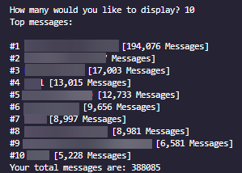

# Discord-Stats

This program uses discords package data 
(settings -> privacy & safety -> request all my data)
 to count how many messages you have sent in total, and will rank who you sent the most messages to.

Special thanks to Tyler Luedtke for providing the loading bar
https://www.youtube.com/watch?v=MtYOrIwW1FQ
