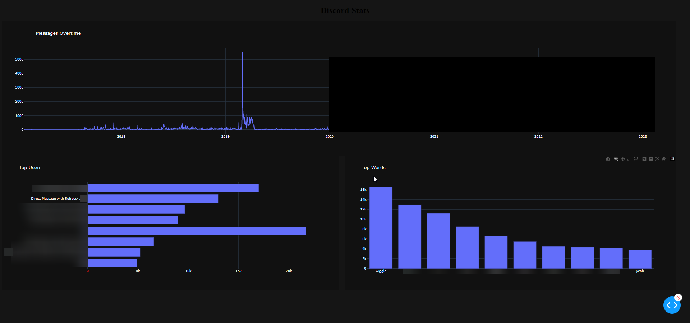

# Discord-Stats

This program uses discords package data 
*(settings -> privacy & safety -> request all my data)*
 to count how many messages you have sent in total, and will rank who you sent the most messages to. You can also graph your messages overtime and rank your most used words.
 
1. Must have python installed
2. pip install -r requirements.txt
3. Run setup.py
4. Run main.py

Please be careful with your data package. It includes all the messages sent on discord; Do not send it to anyone

Special thanks to:
* Tyler Luedtke for providing the loading bar, https://www.youtube.com/watch?v=MtYOrIwW1FQ
* @Alir3z4 for providing stop words
